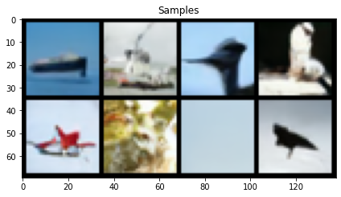
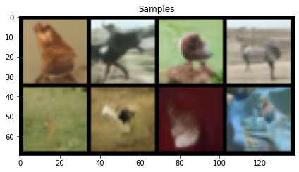

# Assignment 2: Generative Modeling (10% of total class credit)

- [Visual Learning and Recognition (16-824) Fall 2022](https://visual-learning.cs.cmu.edu/index.html)
- TAs: Vanshaj Chowdhary (vanshajc), Anirudh Chakravarthy (achakrav)
- Based on Spring 2019 Deep Unsupervised Learning at UC Berkeley, Homework 3 and Homework 4
- Please post questions, if any, on the piazza for HW2.
- Total points: 90 + 20 (extra credit)
- Due Date: Oct 26, 2022 at 11:59pm EST.
- Please start EARLY!

In this assignment you will explore three main generative modeling architectures:

1. Implement a basic GAN network architecture, the standard GAN [1](https://arxiv.org/pdf/1406.2661.pdf), LSGAN [2](https://arxiv.org/pdf/1611.04076.pdf) and WGAN-GP [3](https://arxiv.org/pdf/1704.00028.pdf)
2. Implement an auto-encoder, variational auto-encoder (VAE) [4](https://arxiv.org/pdf/1606.05908.pdf) and a beta-VAE [5](https://arxiv.org/pdf/1804.03599.pdf) with linear schedule.
3. (Extra Credit) Implement DDPM [6](https://arxiv.org/abs/2006.11239) and DDIM [7](https://arxiv.org/abs/2010.02502) sampling for diffusion models.

**Submission Requirements**:

* Please submit your report as well as your code.
* You should also mention any collaborators or other sources used for different parts of the assignment.

## Software setup

Please use Python 3.8.

Please run `pip install -r requirements.txt` to install the necessary dependencies for this homework.

## Task 0: Setup (0 points)
Please follow these directions exactly!
```
cd gan/
mkdir datasets/
gdown https://drive.google.com/uc\?id\=1hbzc_P1FuxMkcabkgn9ZKinBwW683j45 -O datasets/
tar zxvf datasets/CUB_200_2011.tgz
mv CUB_200_2011/ datasets/
python resize_dataset.py --input_folder datasets/CUB_200_2011/images --output_folder datasets/CUB_200_2011_32/ --res 32
rm -rf datasets/cub.tgz
rm -rf datasets/CUB_200_2011_32/Mallard_0130_76836.jpg datasets/CUB_200_2011_32/Brewer_Blackbird_0028_2682.jpg datasets/CUB_200_2011_32/Clark_Nutcracker_0020_85099.jpg datasets/CUB_200_2011_32/Ivory_Gull_0040_49180.jpg datasets/CUB_200_2011_32/Pelagic_Cormorant_0022_23802.jpg datasets/CUB_200_2011_32/Western_Gull_0002_54825.jpg datasets/CUB_200_2011_32/Ivory_Gull_0085_49456.jpg datasets/CUB_200_2011_32/White_Necked_Raven_0070_102645.jpg
cp cub_clean_custom_na.npz /path/to/python_env/lib/python3.8/site-packages/cleanfid/stats/cub_clean_custom_na.npz
```

## Task 1: Generative Adversarial Networks (60 points)
We will be training our GANs on the CUB 2011 Dataset (http://www.vision.caltech.edu/visipedia/CUB-200-2011.html). This dataset contains 11,708 images of close up shots of different bird species in various environments. Our models will be trained to generate realistic looking samples of these birds. Due to compute considerations for the course, we will be using a downsampled version of the dataset at a 32x32 resolution.

### Question 1.1: GAN Network Architecture
Let's start by setting up our networks for training a Generative Adversarial Network (GAN). As we covered in class, GANs have two networks, a generator and a discriminator. The generator takes in a noise sample z, generally sampled from the standard normal distribution, and maps it to an image. The discriminator takes in images and outputs the probability that the image is real or fake.
You will need to fill out `networks.py` wherever `#TODO 1.1` is written.

### Question 1.2: GAN Training Code
Now we need to setup the training code for the GAN in `train.py`. Most of the code has been provided but please fill out all of the sections that have `#TODO 1.2`.
Additionally, implement a function to do latent space interpolation (see utils.py).

### Question 1.3: Implement GAN loss (20 points)
In general, we train the generator such that it can fool the discriminator, ie samples from the generator will have high probability under the discriminator. Analogously, we train the discriminator such that it can tell apart real and fake images. This means our loss term encourages the discriminator to assign high probability to real images while assigning low probability to fake images. In this section, we will implement the original GAN losses for the generator and discriminator as described in Algorithm 1 of [1]((https://arxiv.org/pdf/1406.2661.pdf)) in `q1_3.py`.

#### Question 1.3.1: Implement the GAN loss from the GAN paper [1](https://arxiv.org/pdf/1406.2661.pdf)
#### Question 1.3.2: Run q1_3.py
#### Question 1.3.3: Analysis
* What is the final FID attained? Additionally, please plot the fid score with respect to training iterations and report the final score.
* How do the samples look? Please plot them here.
* How does the latent space interpolation look, is the latent space disentangled at all?
* As you may have noticed, the FID jumps around a lot (can range from 100 to 150) and the final samples do not look very good. Please describe in your own words why you think this might be the case.

### Question 1.4: Implement LSGAN loss (20 points)
For this question, please read [2](https://arxiv.org/pdf/1611.04076.pdf) and implement equation (2) as the loss for the generator and discriminator with c=1 in `q1_4.py`.

#### Question 1.4.1: Implement the GAN loss from the LSGAN paper [2](https://arxiv.org/pdf/1611.04076.pdf)
#### Question 1.4.2: Run q1_4.py
#### Question 1.4.3: Analysis
* What is the final FID attained? Additionally, please plot the fid score with respect to training iterations and report the final score.
* How do the samples look? Please plot them here.
* How does the latent space interpolation look, is the latent space disentangled at all?
* If this section was implemented correctly, you should have a final FID in the ballpark of *90* and the samples should look reasonable at this point (you should see some birds but they might be imperfect). In your own words, describe why you think this version of the GAN loss was more stable than the original.

### Question 1.5: Implement WGAN-GP loss (20 points)
For this question, please read the WGAN-GP paper [3](https://arxiv.org/pdf/1704.00028.pdf) and implement the generator and discriminator losses from Algorithm 1 in `q1_5.py`. You may also refer to these slides(https://docs.google.com/presentation/d/1kZJ3RBfD-vnwOZQYlpH4qbTcICUcYhK0UXEQlnl3h4g/edit#slide=id.g4ce74c3fd4_0_185) which cover WGAN and WGAN-GP.
Additionally, implement the interpolated batch (which is necessary for the loss) in `train.py`.

#### Question 1.5.1: Implement the GAN loss in [3](https://arxiv.org/pdf/1704.00028.pdf)
#### Question 1.5.2: Run q1_5.py
#### Question 1.5.3: Analysis
* What is the final FID attained? Please plot the fid score with respect to training iterations and report the final score.
* How do the samples look? Please plot them here.
* How does the latent space interpolation look, is the latent space disentangled at all?
* If this section was implemented correctly, you should have a final FID in the ballpark of *50* and the samples should look reasonable at this point (you should see some birds that look reasonable). In your own words, describe why you think this version of the GAN loss was so much more stable and performant than the previous two.

### Debugging Tips
1. Run export PYTORCH_JIT=0 when debugging. This will disable JIT, which will slow down the code but enable you to use pdb to debug. In Jupyter notebooks, you can add the following cell to do the same (make sure to do this at the top of the file): 
```
import os
os.environ["PYTORCH_JIT"] = "0"
```
2. GAN losses are pretty much meaningless! If you want to understand if your network is learning, visualize the samples. The FID score should generally be going down as well.
3. Don't change the hyper-parameters at all, they have been carefully tuned to ensure the networks will train stably, if things aren't working its a bug in your code.

## Task 2: Variational Autoencoders (30 points)

We will be training AutoEncoders and VAEs on the CIFAR10 dataset.

### Question 2.1: AutoEncoder (10 points)
#### Question 2.1.1: Architecture
In model.py, fill in the TODOs where 2.1.1 is mentioned. This includes the encoder and decoder network architectures, and the forward passes through each. 

#### Question 2.1.2: Loss function
In train.py, fill in the TODOs where 2.1.2 is mentioned. This includes the loss function for the autoencoder, which is the MSE loss between the input data and the reconstruction. Important - remember to only average across the batch dimension. 

#### Running the auto-encoder
* Run the command under 2.1  (commands to run can be found at the end of the train.py file). Train the autoencoder for 20 epochs, and try latent sizes 16, 128 and 1024. If your code is correct, the reconstructions should be very clear and sharp. 
* Plot the reconstruction loss (for the valiation data) versus number of epochs trained on for all three latent size settings on the same plot.
* Include the reconstruction plots from epoch19 for each latent setting. Which latent size performs best? What are possible reasons for this?

### Question 2.2: Variational Auto-Encoder (10 points)
#### Question 2.2.1: Architecture
In model.py. fill in the TODOs where 2.2.1 is mentioned. This only includes the fc layer of the VAEEncoder, and the forward pass through the network.

#### Question 2.2.2: Loss function 
Fill in the recon_loss and kl_loss that make up the total loss for the VAE, under the TODO where 2.2.2 is mentioned. Important - remember to only average across the batch dimension. 

#### Running the VAE
* Run the command under 2.2 (run for 20 epochs). 
* Plot the reconstruction loss and kl loss (for the valiation data) versus number of
  epochs (separate plots). Recon loss of reference solution is < 145 at epoch 19 (remember to average only across batch dimension). 
* Include reconstruction and sample plots from epoch 19. 

### Question 2.3: Beta Variational Auto-Encoder (10 points)
#### Question 2.3.1: Tuning beta
The blurriness of the samples can be reduced by tuning the value of beta. 
* Compare the performance of the models with beta values 0.8, 1, 1.2. (Recon loss at epoch 19 of reference solutions are < 130 for beta0.8, and <155 for beta1.2)
* Comment on the recon loss, kl loss and quality of samples. (Even with tuning, the samples will still be blurry)
* For what value of beta does the VAE reduce to an auto-encoder?

#### Question 2.3.2: Linear schedule for beta
Another way to improve the quality of samples is to use an annealing scheme for beta. Fill in TODO for 2.3.2. The value of beta should increase linearly from 0 at epoch 0 to target_val at epoch max_epochs.
* Include plots of samples from epoch 19. Plot the recon loss across epochs (Recon loss at epoch 19 of reference solution is < 125) 
* How do these compare to those from the vanilla VAE ? 

### Debugging Tips
1. Make sure the autoencoder can produce good quality reconstructions before moving on to the VAE. While the VAE reconstructions might not be clear and the VAE samples even less so, the autoencoder reconstructions should be very clear.


## Task 3: (Extra Credit) Diffusion Models (20 points)

We will be training diffusion models on CIFAR-10 and compare the results to GAN and VAE.

Diffusion models have recently becoming very popular generative modeling technique. In this assignment, we will experiment with different sampling methods for diffusion models. Diffusion models apply a series of gaussian noise to an input image, and try to denoise these noisy images by predicting the noise at each timestep. For this assignment, we will use the provided pretrained diffusion model trained on CIFAR-10 and will implement different sampling techniques for model inference.

Given an input image $x_0$, the forward process sequentially applies a gaussian noise to the image as follows:
$$q(x_t | x_{t-1}) = \mathcal{N}(x_t; \sqrt{1 - \beta_t} x_{t-1}, \beta_t\mathcal{I})$$

where $\beta$ is defined as some variance schedule. In our case, we use a cosine schedule to set $\beta$.

The above equation depends on $x_{t-1}$ for each $x_t$ which implies that to get the noised output at time $t$, we need the noised output at $t-1$. However, we already fixed the beta schedule beforehand, and therefore we can reparametrize the above equation and generate any arbitrary noised input $x_t$ directly, just given our initial image $x_0$:
$$q(x_t | x_0) = \mathcal{N}(x_t; \sqrt{\bar{\alpha_t}} x_0, (1 - \alpha_t)\mathcal{I})$$

$$\alpha_t = 1 - \beta_t, \bar{\alpha_t} = \prod_{i=1}^t \alpha_i$$

We know how much noise we have added in the forward process. Therefore, we take the output from the forward process $x_t$ and using a denoising network (which takes the noised image and timestamp as inputs), we predict the noise $\epsilon_t$ which was added. By repeating this several times, we can predict the starting image $x_0$. This is called the reverse process.
$$x_0 = \frac{1}{\sqrt{\bar{\alpha_t}}} (x_t - \sqrt{1 - \bar{\alpha_t}} \epsilon_t)$$


### 3.1 Denoising Diffusion Probabilistic Models (8 points)

To run inference using Denoising Diffusion Probabilistic Models (DDPM), we first sample a random noise vector $x_T$ and apply the denoising process repeatedly with the equation below to generate $x_0$.

$$x_{t - 1} = \tilde{\mu}_t + \sigma_t z$$

$$\tilde{\mu_t} = \frac{\sqrt{\alpha_t} (\bar{\alpha_{t-1}})}{1 - \bar{\alpha_t}} x_t + \frac{\sqrt{\bar{\alpha_{t-1}}}\beta_t}{1 - \bar{\alpha_t}} x_0$$

$$\sigma_t = \tilde{\beta_t} = \frac{1 - \bar\alpha_{t - 1}}{1 - \bar\alpha_t} \beta_t$$

Here $z$ is a random noise vector from a standard normal distribution.

The algorithm should then look something like:

1. Sample random noise vector $x_T$.
2. For each t in $[T, 1]$
   1. Sample a noise vector $z$ if t > 0 otherwise, $z$ = 0.
   2. Find $x_{t-1}$ using the equations above.
3. Return $x_0$

#### Question 3.1: Implement DDPM sampling as described above to generate samples from the pretrained diffusion model. Below is an example of some generated samples from the pretrained model. (8 points)



### 3.2 Denoising Diffusion Implicit Model (12 points)
The issue with DDPM is that we need to loop over all the timestamps sequentially, which is not very efficient. Denoising Diffusion Implicit Model (DDIM) samples a small number of timesteps $S$ from the total timestamps. We can do this sampling evenly across the $[1, T]$ range with a step-size of $\frac{T}{S}$ to get a total of S timesteps $[\tau_1, \tau_2, ..., \tau_{S}]$. 

$$q(x_{\tau_{i - 1}} | x_{\tau_t}, x_0) = \mathcal{N}(x_{\tau_{i-1}}; \sqrt{\bar{\alpha_{t-1}}} x_0 + \sqrt{1 - \bar{\alpha_{t-1}} - \sigma_{t}^2} \epsilon_t; \sigma_t^2 \mathcal{I}) $$

$$\sigma_{t}^2 = \eta \tilde{\beta_t}, \hspace{10px} \tilde{\beta_t} = \frac{1 - \bar{\alpha_{t - 1}}}{1 - \bar\alpha_t} \beta_t$$

where $\eta$ is a hyperparameter along with $S$. Here $q$ represents the distribution from which we can sample to get $x_{\tau_{i - 1}}$.

The algorithm for DDIM should then look something like:
1. Sample random noise vector $x_T$.
2. For each t in $[\tau_S, \tau_{S - 1}, ..., \tau_1]$
   1. Sample a noise vector $z$ if t > 0 otherwise, $z$ = 0.
   2. Find $x_{\tau_{i - 1}}$ using the equations above.
3. Return $x_0$

#### Question 3.2.1: Implement the DDIM sampling method. Below is an example of some generated samples from the pretrained model. (4 points)



#### Question 3.2.2: DDIM Analysis (4 points)
* Describe the performance of DDIM sampling with different number of sampled timestamps (S). Plot generated samples with atleast 3 different values of S. Discuss any potential trade-offs for choosing S. (2 points)

* Describe the performance of DDIM sampling with different $\eta$ values. Plot generated samples with atleast 3 different values of $\eta$. Discuss any potential trade-offs for choosing $\eta$. (2 points)

#### Question 3.2.4: Other sampling methods for diffusion models (2 points)
* Describe and implement another sampling method with the diffusion model for inference and describe the advantages and disadvantages of your idea.

#### Question 3.2.5: Comparison with GANs and VAEs (2 points)
* Compare the quality of the generated samples from the diffusion model with GANs and VAEs. Include both quantiative (FID) and qualitative analysis. 


## Relevant papers:
[1] Generative Adversarial Nets (Goodfellow et al, 2014): https://arxiv.org/pdf/1406.2661.pdf

[2] Least Squares Generative Adversarial Networks (Mao et al, 2016): https://arxiv.org/pdf/1611.04076.pdf

[3] Improved Training of Wasserstein GANs (Gulrajani et al, 2017): https://arxiv.org/pdf/1704.00028.pdf

[4] Tutorial on Variational Autoencoders (Doersch, 2016): https://arxiv.org/pdf/1606.05908.pdf

[5] Understanding disentangling in β-VAE (Burgess et al, 2018): https://arxiv.org/pdf/1804.03599.pdf

[6] Denoising diffusion probabilistic models (Jonathan Ho, et al, 2020): https://arxiv.org/abs/2006.11239

[7] Denoising diffusion implicit models (Jiaming Song et al, 2020): https://arxiv.org/abs/2010.02502

[8] What are diffusion models? Lil’Log. (Lilian Weng, 2021): https://lilianweng.github.io/posts/2021-07-11-diffusion-models/


## Submission Checklist
### Report

Specification of collaborators and other sources.

All visualizations and plots as well as your responses to the questions, ordered by question number.
Please make a separate pdf report in which you include your results. Put each sub-question, ie. 1.3, 1.4, 1.5 on a separate page.

### Files
Your code in the `gan/`, `vae/`, `diffusion/` folders.

